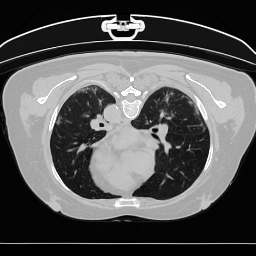
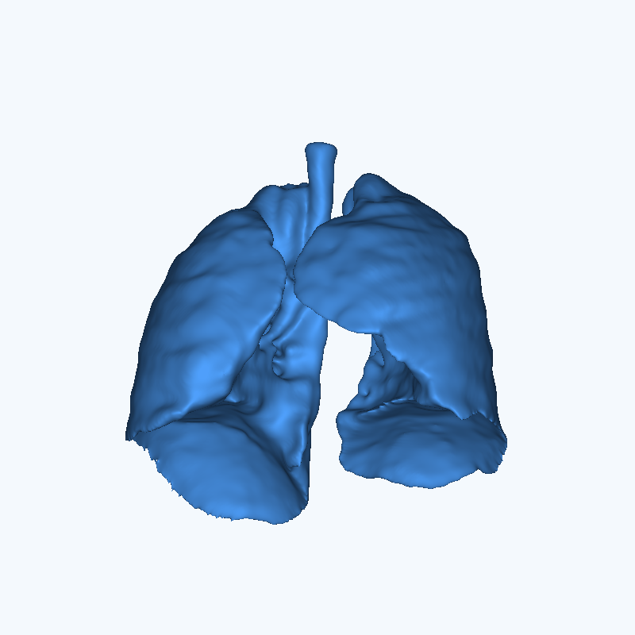
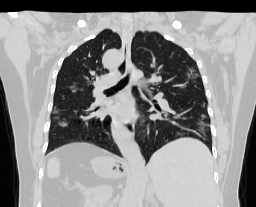

# SynthRCT: Scalable Conditional Deformation Synthesis for Synthetic Repeat CT Generation

[](https://arxiv.org/abs/2609.08627)


This is the official repository for the paper "**SynthRCT: Scalable Conditional Deformation Synthesis for Synthetic Repeat CT Generation**".
RCTSynth learns a distribution of plausible anatomical deformations from longitudinal CT images. Given one moving CT volume, the model can sample latent deformation codes, decode them into dense deformation fields, and generate multiple anatomically consistent repeat CT volumes.


## Method

RCTSynth is a conditional variational registration model. During training, a posterior encoder observes a fixed/moving CT pair and estimates `q(z | fixed, moving)`, while an anatomy-conditioned prior estimates `p(z | moving)` from the moving image alone. A latent-conditioned decoder predicts stationary velocity fields (SVFs) over overlapping axial slabs. The slab predictions are stitched and refined, integrated into a dense deformation field, and used to warp the input CT.

This design supports:

- patient-specific sampling from a single input CT;
- full-volume synthesis using a memory-aware slab decoder;
- smooth latent-space traversals and interpolation;
- export of warped CT volumes, SVFs, and displacement fields.

## Installation

Python 3.10 or newer is recommended. Clone the repository and install it in editable mode:

```bash
git clone https://github.com/TomasGuija/RCTSynth.git
cd RCTSynth

python3 -m venv .venv
source .venv/bin/activate
pip install -e .
```

That command installs RCTSynth and the dependencies required for training and inference. To run the Jupyter notebook and export GIFs, install the notebook extras instead:

```bash
pip install -e ".[notebook]"
```

If you need a specific CUDA-enabled PyTorch build, install the appropriate PyTorch version first and then run `pip install -e .`. CPU inference is supported but full-volume decoding can be slow.

## Pretrained weights

The pretrained RCTSynth weights are openly available from
[Hugging Face](https://huggingface.co/TomasGuija/RCTSynth). Public downloads do
not require authentication.

Install the Hugging Face Hub client and download the model configuration and
checkpoint into the path used by the inference notebook. The configuration
records the released architecture, checkpoint format, and weight checksum.

```bash
pip install huggingface_hub
hf download TomasGuija/RCTSynth \
  config.json rctsynth.ckpt \
  --local-dir checkpoints
```

The same files can be downloaded and the checkpoint loaded from Python:

```python
from huggingface_hub import hf_hub_download
from rctsynth.utils.model_loading import load_vae

config_path = hf_hub_download(
    repo_id="TomasGuija/RCTSynth",
    filename="config.json",
    local_dir="checkpoints",
)

checkpoint_path = hf_hub_download(
    repo_id="TomasGuija/RCTSynth",
    filename="rctsynth.ckpt",
    local_dir="checkpoints",
)

module, model = load_vae(checkpoint_path, device="cuda")
```

## Data preparation

Training data are not distributed with this repository. Training expects a local HDF5 file containing normalized CT volumes, case and respiratory/time identifiers, and valid axial ranges. The complete schema is documented in [`src/rctsynth/data/README.md`](src/rctsynth/data/README.md).

Update `data.h5_path` and `data.val_case_ids` in [`config/vae.yaml`](config/vae.yaml) before training. Images in the HDF5 file must already be preprocessed and normalized, normally to `[0, 1]`.

For inference on a single NIfTI CT, the included preprocessing utility resamples, center-crops or pads, normalizes the image, and creates heuristic body and lung masks:

```bash
python src/rctsynth/data/preprocess_ct.py \
  --input-nii /path/to/input_ct.nii.gz \
  --output-dir data/demo \
  --target-shape 207 256 256 \
  --spacing-mm 1.5 \
  --norm-mode clip
```

The masks produced by this script are threshold-based aids for demos and cropping; they are not clinical segmentations.

The demonstration CT sample used during development was extracted from the **COVID-19 CT Lung and Infection Segmentation Dataset**. 

## Training

After preparing the HDF5 dataset and updating the configuration, start training from the repository root:

```bash
python -m rctsynth.training.train fit --config config/vae.yaml
```

To resume a run from a Lightning checkpoint:

```bash
python -m rctsynth.training.train fit \
  --config config/vae.yaml \
  --ckpt_path /path/to/last.ckpt
```

## Inference

The recommended inference entry point is [`notebooks/inference_demo.ipynb`](notebooks/inference_demo.ipynb).

The notebook demonstrates how to load the checkpoint, sample the anatomy-conditioned prior, synthesize a random repeat CT, and save the warped volume. It also samples the patient-specific latent space, performs a principal-component traversal around the encoded identity deformation, and exports intermediate warped images and displacement fields as NIfTI files.

The 2D interpolation GIF uses Pillow. The optional surface-rendered lung GIF additionally requires a local [3D Slicer](https://www.slicer.org/) installation and a valid `SLICER_EXECUTABLE` path.

<table width="100%" cellpadding="12" cellspacing="8" bgcolor="#EAF6FF">
  <tr>
    <td width="40%" align="center" valign="middle" bgcolor="#D9EEFF">
      <span style="color:#174A6E"><strong>Axial view</strong></span><br>
      
    </td>
    <td width="60%" rowspan="2" align="center" valign="middle" bgcolor="#D9EEFF">
      <span style="color:#174A6E"><strong>3D lung deformation</strong></span><br>
      
    </td>
  </tr>
  <tr>
    <td align="center" valign="middle" bgcolor="#D9EEFF">
      <span style="color:#174A6E"><strong>Coronal view</strong></span><br>
      
    </td>
  </tr>
</table>


## License

The RCTSynth software and released model weights are available under the
[MIT License](LICENSE). The third-party demo data under `data/demo/` are not
covered by that license; see
[`THIRD_PARTY_NOTICES.md`](THIRD_PARTY_NOTICES.md) for provenance and terms.

## Citation

Coming soon.

## References

[1] Ma, J., et al. (2020). *COVID-19 CT Lung and Infection Segmentation Dataset*. [https://doi.org/10.5281/zenodo.3757476](https://doi.org/10.5281/zenodo.3757476).

[2] Castillo, E., Castillo, R., Martinez, J., Shenoy, M., & Guerrero, T. (2010). Four-dimensional deformable image registration using trajectory modeling. *Physics in Medicine and Biology, 55*(1), 305–327. https://doi.org/10.1088/0031-9155/55/1/018

[3] Castillo, R., Castillo, E., Guerra, R., Johnson, V. E., McPhail, T., Garg, A. K., & Guerrero, T. (2009). A framework for evaluation of deformable image registration spatial accuracy using large landmark point sets. *Physics in Medicine and Biology, 54*(7), 1849–1870. https://doi.org/10.1088/0031-9155/54/7/001
